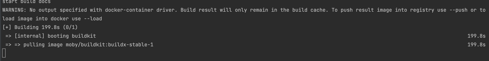

##  docker文档
* [Docker 安装文档](https://docs.docker.com/engine/install/centos/)
* [Docker 菜鸟教程](https://www.runoob.com/docker/docker-image-usage.html)
* [Docker 官方主页](https://www.docker.com)
* [Docker 官方博客](https://blog.docker.com/)
* [Docker 官方文档](https://docs.docker.com/)
* [Docker Store](https://store.docker.com)
* [Docker Cloud](https://cloud.docker.com)
* [Docker Hub](https://hub.docker.com)
* [Docker 的源代码仓库](https://github.com/moby/moby)
* [Docker 发布版本历史](https://docs.docker.com/release-notes/)
* [Docker 常见问题](https://docs.docker.com/engine/faq/)
* [Docker 远端应用 API](https://docs.docker.com/develop/sdk/)

##  卸载docker
官网方式，腾讯云服务器亲测卸载失败，使用下面的指定删除方式成功
```shell script
 sudo yum remove docker \
                 docker-client \
                 docker-client-latest \
                 docker-common \
                 docker-latest \
                 docker-latest-logrotate \
                 docker-logrotate \
                 docker-engine
```
注：运行中的docker是不能用此方法卸载的，卸载前先查看docker的运行状态
```shell script
systemctl status docker
```
若是 Active: active(running)，则需要先停止docker
```shell script
systemctl stop docker
```
查看yum安装的docker文件包
```shell script
yum list installed | grep docker
```
查看docker的相关rpm源文件
```shell script
rpm -pa | grep docker
```
删除所有的docker安装文件包(按实际情况修改)
```shell script
yum -y remove containerd.io.x86_64
yum -y remove docker-ce.x86_64
yum -y remove docker-ce-cli.x86_64
```
删除docker的镜像文件，默认在/var/lib/docker目录下 
```shell script
rm -rf /var/lib/docker
```

##  安装docker
设置仓库
```shell script
sudo yum install -y yum-utils
sudo yum-config-manager \
    --add-repo \
    https://download.docker.com/linux/centos/docker-ce.repo
```
安装docker
```shell script
sudo yum install docker-ce docker-ce-cli containerd.io
```

```注：docker-ce-cli 作用是docker命令行工具包 *containerd.io* 作用是容器接口相关包```

启动docker并设置空开机自启

```she
systemctl start docker && systemctl enable docker
```


##  [腾讯云服务器安装docker](https://cloud.tencent.com/document/product/213/46000?from=information.detail.%E8%85%BE%E8%AE%AF%E4%BA%91%E6%9C%8D%E5%8A%A1%E5%99%A8%E5%AE%89%E8%A3%85docker)

```shell script
yum update
yum install epel-release -y
yum clean all
yum list
```
```shell script
yum install docker-io -y
systemctl start docker
docker info
```

---
## 使用docker
###  命令大全
   * 容器生命周期管理

```shell script
run
start/stop/restart
kill
rm
pause/unpause
create
exec
```

   * 容器操作
```shell
ps
inspect
top
attach
events
logs
wait
export
port
```
   * 容器rootfs命令
```shell
commit
cp
diff
```
   * 镜像仓库
```shell
login
pull
push
search
```
   * 本地镜像管理
```shell   
images
rmi
tag
build
history
save
load
import
info|version
info
version 
```

### 管理docker守护进程
* 运行 Docker 守护进程
```shell script    
systemctl start docker
```
* 停止 Docker 守护进程
```shell script    
systemctl stop docker
```
* 重启 Docker 守护进程
```shell script    
systemctl restart docker            
```

 ### 管理镜像          

docker pull nginx 
    
* 修改标签：您可以修改镜像标签以便记忆区分
```shell script    
docker tag docker.io/nginx:latest tencentyun/nginx:v1
```
* 查看已有镜像
```shell script    
docker images
```
* 强制删除镜像
```shell script    
docker rmi -f tencentyun/nginx:v1         
```
* 导出镜像
```shell script
docker export -o mysql-`date +%Y%m%d`.tar a404c6c174a2
docker save -o collect.tar mysql redis 
```
* 导入镜像
```
docker import <文件路径>  <容器名>
```
* 设置镜像标签  
```shell script
docker tag 860c279d2fec runoob/centos:dev        
```
* 查看容器占用磁盘大小


```shell
docker system df
docker system df -v
```

* 查看启动容器的命令

```shell
# 通过docker --no-trunc参数来详细展示容器运行命令
docker ps -a --no-trunc | grep container_name   


1，在容器外部，物理机上，可以用下面命令
docker inspect <container_name>   # 可以是container_name或者container_id

# 默认的输出信息很多，可以通过-f, --format格式化输出：
docker inspect --format='{{.NetworkSettings.Networks.bridge.IPAddress}}' <container_name>      # format是go语言的template，还有其他的用法   

2，如果在容器内部。可以用下面命令
ps -ef    # 其中1号进程就是command启动命令
```

* 备注
```shell    
docker save 保存的是镜像（image），docker export 保存的是容器（container）
docker load 用来载入镜像包，docker import 用来载入容器包，但两者都会恢复为镜像
docker load 不能对载入的镜像重命名，而 docker import 可以为镜像指定新名称             
```
###  管理容器
* 启动并进入容器
 ```shell script   
 docker run -it ImageId /bin/bash
 ```
* 退出容器：执行 exit 命令，退出当前容器
  
* 进入后台运行的容器
```shell script    
docker exec -it 容器 ID /bin/bash
```
* 将容器做成镜像
```shell script    
docker commit <容器 ID 或容器名> [<仓库名>[:<标签>]]            
```
* 进入后台运行的容器
```shell script    
docker exec -it 容器 ID /bin/bash                        
```


###  制作镜像
* 执行以下命令，打开 Dockerfile 文件
```shell script
vim Dockerfile
```
* 打包需要运行的文件
```text
GOOS=linux go build -mod vendor
```
* 按 i 切换至编辑模式，添加如下内容
```text
FROM alpine:latest  # 基础镜像

RUN mkdir -p /data/service/blog/bin # 执行命令,每次执行都会多一层镜像，可用 && 合并执行命令
ADD blog /data/service/blog/bin  # 添加文件
WORKDIR  /data/service/blog  # 设置工作目录

EXPOSE 8888  # 声明端口

EXPOSE 8080

CMD ./bin/blog # 
```
* 按 Esc，输入 :wq，保存文件并返回

* 执行以下命令，构建镜像
```shell script
docker build -t blog:v1 .  #.是 Dockerfile 文件的路径，不能忽略。         
```
* 执行以下命令，查看镜像是否创建成功
```shell script
docker images         
```
* 依次执行以下命令，运行容器并查看容器

```text
docker run -d nginxos:v1         #后台运行容器。
docker ps                        #查看当前运行中的容器。
docker ps -a                     #查看所有容器，包括未运行中的。
docker logs CONTAINER ID/IMAGE   #如未查看到刚才运行的容器，则用容器 ID 或者名字查看启动日志排错。         
```
* 依次执行以下命令，制作镜像
```text
docker commit fb2844b6**** nginxweb:v2 #commit 参数后添加容器 ID 和构建新镜像的名称和版本号。
docker images                    #列出本地（已下载的和本地创建的）镜像。          
```
* 执行以下命令，将镜像推送至远程仓库。
  默认推送到 Docker Hub。您需要先登录 Docker，为镜像绑定标签，将镜像命名为 Docker 用户名/镜像名:标签的格式，最终完成推送
```text
docker login #执行后输入镜像仓库用户名及密码
docker tag [镜像名]:[标签] [用户名]:[标签]
docker push [用户名]:[标签]
```

###  options说明
```text 
-d :分离模式: 在后台运行

-i :即使没有附加也保持STDIN 打开

-t :分配一个伪终端
```

###  docker国内镜像
```text
阿里云的加速器：https://help.aliyun.com/document_detail/60750.html

网易加速器：http://hub-mirror.c.163.com

官方中国加速器：https://registry.docker-cn.com

ustc 的镜像：https://docker.mirrors.ustc.edu.cn

daocloud：https://www.daocloud.io/mirror#accelerator-doc（注册后使用）
```

### docker容器容器重启
* 启动时添加命令

```shell
docker run --restart=always
```
   * 已启动的容器则更新启动命令
```shell
docker update --restart=always <CONTAINER ID>
```


## 问题

### 镜像启动失败"exec format error"

* GO镜像启动：standard_init_linux.go:190: exec user process caused "exec format error"

!> 如果出现以上错误是因为你的golang在build时没有指定为linux平台，因为Docker内核依赖于Linux开发的，所以在mac os启动Docker时还是使用Boot2Docker引起的，可以指定构建平台

```
CGO_ENABLED=0 GOOS=linux GOARCH=amd64 go build
```

* WARNING: The requested image's platform (linux/arm64/v8) does not match the detected host platform (linux/amd64) and no specific platform was requested  

使用`docker image inspect {image}`可以查看信息


可以使用 `--platform linux/amd64 `来改变镜像的运行环境，更多build的运行参数可以使用`docker builder build --help`查看

```shell
docker build --platform linux/amd64 -f Dockerfile -t ccr.ccs.tencentyun.com/jgaonet/docs:v${Version} .
```


!> 若是项同时构建多个体系的镜像，可以使用 *buildx* 建立多个体系的构建

```shell
docker buildx build --platform linux/amd64,linux/arm64 .
```

或许执行打包的时候会出现错误

```
ERROR: multiple platforms feature is currently not supported for docker driver. Please switch to a different driver (eg. "docker buildx create --use")
```

这是因为当前docker没有这个驱动，执行 `docker buildx create --use` 创建构建任务节点之后再进行打包处理



此时会自动下载需要的驱动，但是耗时会很长，需要等待。

!> 默认情况下多平台打包的镜像无法通过`docker images`查看

所以在构建镜像的同时使用 `--push`把镜像推送到远程，这个需要在构建前先登陆到远程仓库。

```shell
docker buildx build --platform linux/amd64,linux/arm64 -f Dockerfile -t ccr.ccs.tencentyun.com/jgaonet/docs:v${Version} --push .
```


### pull镜像失败

`toomanyrequests: You have reached your pull rate limit. You may increase the limit by authenticating and upgrading: https://www.docker.com/increase-rate-limit
` 

这是因为从 2020-11-02 开始，官方的 Docker Hub 开始对 pull 请求加上了限制，限制为匿名用户（未登录），每分钟只能拉 100 次 image，登录的免费用户每分钟拉 200 次 镜像

解决方式 

```
修改 /etc/docker/daemon.json 中的

{
  "registry-mirrors": ["https://ustc-edu-cn.mirror.aliyuncs.com"],
}
```
但是此镜像也可能出现问题，对于腾询服务器，配置已经默认如下
```
 http://docker.oa.com:8080
 http://csighub.tencentyun.com
```
只需要把  `http://docker.oa.com:8080` 去掉即可

重启docker
```shell
systemctl daemon-reload && systemctl restart docker
```


### redis启动失败

```text
shell-init: error retrieving current directory: getcwd: cannot access parent directories: No such file or directory
*** FATAL CONFIG FILE ERROR (Redis 6.0.8) ***
Reading the configuration file, at line 341
>>> 'set-proc-title yes'
Bad directive or wrong number of arguments
```
这是环境变量冲突导致的，需要把redis相关的环境变量去除，则启动成功


### docker的overlay2文件夹太大

```shell script
docker system prune
```
命令可以用于清理磁盘，删除关闭的容器、无用的数据卷和网络，以及dangling镜像(即无tag的镜像)


### 安装过docker的系统重装系统再次安装后启动报错

```
v 19 15:06:33 VM_0_16_centos dockerd-current[10379]: time="2021-11-19T15:06:33.262087118+08:00" level=info msg="Firewalld running: false"
Nov 19 15:06:33 VM_0_16_centos dockerd-current[10379]: Error starting daemon: Error initializing network controller: error obtaining controll...nsmod?)
Nov 19 15:06:33 VM_0_16_centos dockerd-current[10379]: Perhaps iptables or your kernel needs to be upgraded.
Nov 19 15:06:33 VM_0_16_centos dockerd-current[10379]: (exit status 3)
Nov 19 15:06:33 VM_0_16_centos systemd[1]: docker.service: main process exited, code=exited, status=1/FAILURE
Nov 19 15:06:33 VM_0_16_centos systemd[1]: Failed to start Docker Application Container Engine.
Nov 19 15:06:33 VM_0_16_centos systemd[1]: Unit docker.service entered failed state.
Nov 19 15:06:33 VM_0_16_centos systemd[1]: docker.service failed.
```

使用命令 `journalctl -xe | grep docker` 查看日志得

```
Nov 19 15:14:21 VM_0_16_centos dockerd-current[13155]: time="2021-11-19T15:14:21.926382325+08:00" level=warning msg="could not change group /var/run/docker.sock to docker: group docker not found"
Nov 19 15:14:21 VM_0_16_centos dockerd-current[13155]: time="2021-11-19T15:14:21.934382961+08:00" level=info msg="libcontainerd: new containerd process, pid: 13162"
Nov 19 15:14:21 VM_0_16_centos dockerd-current[13155]: time="2021-11-19T15:14:21.964378867+08:00" level=warning msg="Docker could not enable SELinux on the host system"
Nov 19 15:14:21 VM_0_16_centos dockerd-current[13155]: time="2021-11-19T15:14:21.974320603+08:00" level=info msg="Graph migration to content-addressability took 0.00 seconds"
Nov 19 15:14:21 VM_0_16_centos dockerd-current[13155]: time="2021-11-19T15:14:21.979261111+08:00" level=info msg="Loading containers: start."
Nov 19 15:14:21 VM_0_16_centos dockerd-current[13155]: time="2021-11-19T15:14:21.984177860+08:00" level=warning msg="Running modprobe nf_nat failed with message: `modprobe: WARNING: Module nf_nat not found.`, error: exit status 1"
Nov 19 15:14:21 VM_0_16_centos dockerd-current[13155]: time="2021-11-19T15:14:21.994935787+08:00" level=info msg="Firewalld running: false"
Nov 19 15:14:22 VM_0_16_centos dockerd-current[13155]: Error starting daemon: Error initializing network controller: error obtaining controller instance: failed to create NAT chain: iptables failed: iptables --wait -t nat -N DOCKER: iptables v1.4.21: can't initialize iptables table `nat': Table does not exist (do you need to insmod?)
Nov 19 15:14:22 VM_0_16_centos dockerd-current[13155]: Perhaps iptables or your kernel needs to be upgraded.
Nov 19 15:14:22 VM_0_16_centos dockerd-current[13155]: (exit status 3)
Nov 19 15:14:22 VM_0_16_centos systemd[1]: docker.service: main process exited, code=exited, status=1/FAILURE
-- Subject: Unit docker.service has failed
-- Unit docker.service has failed.
```


看日志得知是 `iptables` 的设置有问题，使用 `ip a` 查看

```
1: lo: <LOOPBACK,UP,LOWER_UP> mtu 65536 qdisc noqueue state UNKNOWN 
    link/loopback 00:00:00:00:00:00 brd 00:00:00:00:00:00
    inet 127.0.0.1/8 scope host lo
       valid_lft forever preferred_lft forever
2: eth0: <BROADCAST,MULTICAST,UP,LOWER_UP> mtu 1500 qdisc pfifo_fast state UP qlen 1000
    link/ether 52:54:00:52:6b:ea brd ff:ff:ff:ff:ff:ff
    inet 192.168.64.4/24 brd 192.168.64.255 scope global eth0
       valid_lft forever preferred_lft forever
```

发现没有 `docker0` 的桥接网络，则手动添加一个

```
ip link add name docker0 type bridge
ip addr add dev docker0 172.17.0.1/16
```

再次使用 `ip a` 查看，则会发现多了 `docker0`的网络

```
1: lo: <LOOPBACK,UP,LOWER_UP> mtu 65536 qdisc noqueue state UNKNOWN 
    link/loopback 00:00:00:00:00:00 brd 00:00:00:00:00:00
    inet 127.0.0.1/8 scope host lo
       valid_lft forever preferred_lft forever
2: eth0: <BROADCAST,MULTICAST,UP,LOWER_UP> mtu 1500 qdisc pfifo_fast state UP qlen 1000
    link/ether 52:54:00:52:6b:ea brd ff:ff:ff:ff:ff:ff
    inet 192.168.64.4/24 brd 192.168.64.255 scope global eth0
       valid_lft forever preferred_lft forever
3: docker0: <BROADCAST,MULTICAST> mtu 1500 qdisc noop state DOWN 
    link/ether 16:e5:98:30:54:05 brd ff:ff:ff:ff:ff:ff
    inet 172.17.0.1/16 scope global docker0
       valid_lft forever preferred_lft forever
```

删除网桥使用 `brctl delbr docker0` 

然后重新启动docker即可


### docker容器中没有yum


docker已经启动的容器中，没有我们想要的命令时，可以先查看系统 `cat /proc/version`


如果是`ubuntu`的话你可以使用apt命令去下载期望的命令

```shell
##跟新
apt-get update
apt install vim
apt install wget
#ping and ifconfig
apt install iputils-ping
apt install net-tools
```

