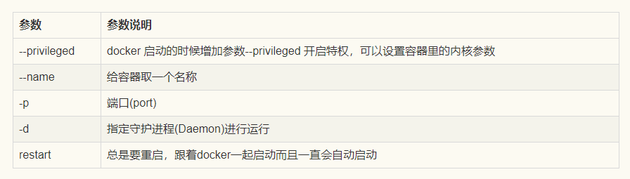

* 下载镜像(https://cr.console.aliyun.com/cn-hangzhou/instances/mirrors)

  ```shell
  docker pull registry.cn-hangzhou.aliyuncs.com/helowin/oracle_11g
  ```

* 启动oracle(默认数据库实例名为：helowin)

  ```shell
  docker run \
  --restart=always \
  -v /Users/panjianghong/persistence/oracle:/home/data \
  --name oracle_11g \
  -p 1521:1521 \
  -d registry.cn-hangzhou.aliyuncs.com/helowin/oracle_11g
  ```

  * 参数说明

    

    

* 进入oracle容器

  ```shell
  docker exec -it 3b844f8f013f /bin/bash
  ```

* 加载环境部变量(可能每次进入都需要加载)

  ```shell
  source /home/oracle/.bash_profile
  ```

* 登录进去(找不到命令则 su root切换root账户，密码helowin)

  ```shell
  sqlplus /nolog
  ```

  * 命令说明

    ```
     sqlplus /nolog   --登录
     conn /as sysdba  --以管理员的身份运行
     alter user system identified by Pan#1208;--修改system用户账号密码；
     alter user sys identified by Pan#1208;--修改sys用户账号密码；
     create user xingquan identified by Pan#1208; -- 创建内部管理员账号密码；
     grant connect,resource,dba to xingquan; --将dba权限授权给内部管理员账号和密码；
     ALTER PROFILE DEFAULT LIMIT PASSWORD_LIFE_TIME UNLIMITED; --修改密码规则策略为密码永不过期；
     alter system set processes=100 scope=spfile; --修改数据库最大连接数据；
    ```

* 以管理员的身份运行

  ```
  conn /as sysdba
  ```

  * 相关命令

    ```
    shutdown immediate; --关闭数据库
    startup; --启动数据库
    exit：退出软链接
    ```

* 创建表空间

  ```sql
  create tablespace GSQ
  logging
  datafile '/home/data/gsq.dbf'
  size 50m
  autoextend on
  next 50m maxsize 30720m
  extent management local;
  ```

* 再次利用以前表空间的数据

  ```sql
  create tablespace GSQ datafile '/home/data/gsq.dbf';
  ```

* 删除表空间数据

  ```sql
  drop tablespace GSQ including contents and datafiles;
  ```

* 用户关联表空间

  ```sql
  alter user xingquan default tablespace GSQ;
  ```

* 创建文件路径

  !> 导入数据需要,没有设置会报文件夹不可用的错误

  ```sql
  create directory dpdata as '/home/data';
  ```

* 授权文件路径

  ```sql
  grant read,write on directory dpdata to xingquan;
  ```

* 导入文件

  ```shell
  -- 授权
  chown -R oracle:oinstall /home/data
  
  --导入 parallel 并行数量
  impdp xingquan/Pan#1208@127.0.0.1:1521/helowin directory=dpdata dumpfile=TESTC2_%U.DMP REMAP_SCHEMA=admin:xingquan REMAP_TABLESPACE=DEFAULT_TBS:GSQ TABLE_EXISTS_ACTION=REPLACE logfile=impdp20221030.log parallel=4
  ```

* 查询数据库实例名

  ```sql
  select instance from v$thread;
  ```

* 查看表空间

  ```sql
  select * from v$tablespace;
  ```

* 查看表空间详情

  ```sql
  select file_name,tablespace_name from dba_data_files;
  ```

* 查看用户默认表空间

  ```sql
  SELECT username,default_tablespace FROM dba_users;
  ```

* 查看表空间大小

  ```sql
  SELECT FILE_NAME AS 数据文件路径,TABLESPACE_NAME AS 表空间名称,AUTOEXTENSIBLE AS 自动扩展,STATUS AS 状态,MAXBYTES AS 可扩展最大值,USER_BYTES AS 已使用大小,INCREMENT_BY AS 自动扩展增量 FROM dba_data_files;
  
  ```

* 扩展表空间

  ```sql
  -- 1.扩展空间，将数据文件扩大至1000MB
  alter database datafile 'D:\DataBase\Test.DBF' resize 100m;
  
  -- 2.自动增长，表空间不足时增加200MB，最大扩展50MB
  alter database datafile 'D:\DataBase\Test.DBF' autoextend on next 200m maxsize 50m; 
  
  -- 3.扩展无限大空间
  alter database DATAFILE 'D:\DataBase\Test.DBF'  autoextend on maxsize unlimited;
  ```


* IMP-00038: Could not convert to environment character set's handle 

  !> 当采用expdp导出dmp后，若采用imp导入dmp，就会报imp-00038这个错误

```
impdp xingquan/Pan#1208@127.0.0.1:1521/helowin directory=dpdata2 dumpfile=TESTC2_%U.DMP REMAP_SCHEMA=admin:xingquan REMAP_TABLESPACE=ADMIN_TBS:GSQ logfile=impdp20221030.log parallel=4


impdp system/Pan#1208@127.0.0.1:1521/xingquan directory=dump_dir dumpfile=TESTC2_%U.DMP logfile=impdp20221024.log parallel=4

system/********@172.17.0.7:1521/rcpfdb directory=dump_dir dumpfile=TESTC2_%U.DMP logfile=impdp20221024.log parallel=4  
```

* 创建用户组

```
# 创建oinstall和dba组
groupadd -g 54321 oinstall
groupadd -g 54322 dba
groupadd -g 54323 oper
# 创建oracle用户
useradd -u 54321 -g oinstall -G dba,oper oracle
# 设置oracle密码
passwd oracle
# 查看创建结果
id oracle
uid=54321(oracle) gid=54321(oinstall) groups=54321(oinstall),54322(dba),54323(oper)
```

* 授权

```
mkdir -p /var/oracle/product/19.3.0/db_1
chown -R oracle:oinstall /var/oracle 
chmod -R 775 /var/oracle
```

  