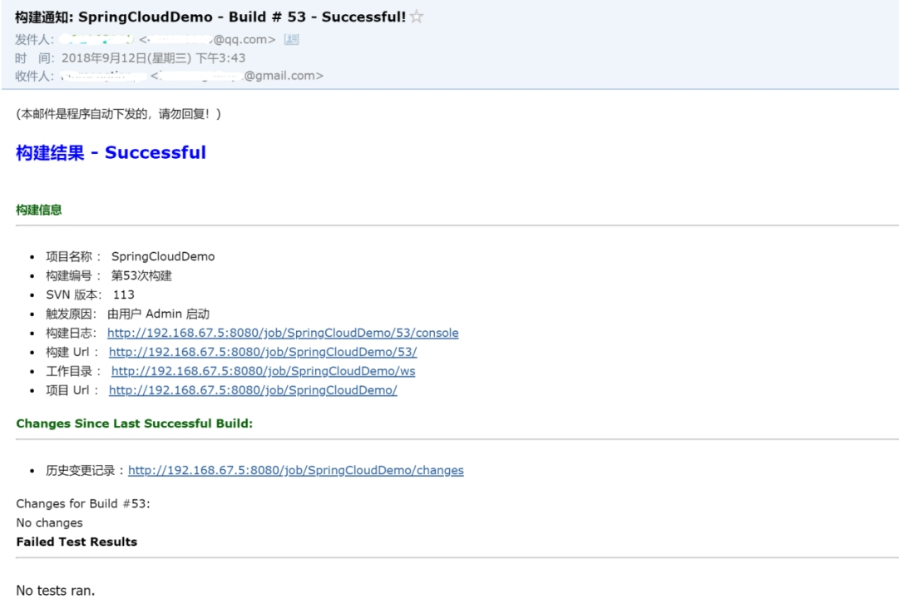

## Jenkins服务搭建

### 简介

本文档主要讲解 Jenkins的安装以及部分功能的实现。

此处所用到的功能有：

* 创建流水线

* 定时检测代码更新情况并构建

* 将构建好的包远程传输到服务器并重启项目

* 构建完成之后发送通知邮件

### 环境准备

* jdk安装以及环境变量(需要java 1.8)

* maven3的安装

* 下载windows/linux版本的war包 `https://jenkins.io/download/`


### 启动安装jenkins

#### 启动jenkins

```shell
 java -jar jenkins.war --httpPort=8080
```


#### 输入密钥

打开浏览器 输入`http:\\localhost:8080` 输入启动时的密码 (dfcb8e2344c04984b53074cc35dbebdb

This may also be found at: ······secrets\initialAdminPassword --- 启动时会打印日志)


#### 安装插件

输入密钥之后会有插件加载选择(是使用默认的还是自定义下载插件)，这里选用默认插件

 

安装的时候可能会有些插件下载失败，这里可以点击 **重试** 重新下载，或者 **继续** 跳过下载，跳过后，还可以在配置界面下载插件。

 

 

#### 初始化账号


 


#### 配置全局信息 jdk git maven

进入 `系统管理->全局工具配置`

 

设置jdk、git、maven路径 不要点击自动安装

 

 

### 创建流水线

#### 新建流水线

输入名称，选择  **构建一个自由风格的软件项目** 

若是已经存在流水线，就可以选择复制配置

 


#### 配置流水线信息

流水线的配置主要是 

* 代码下载(git,svn)  

* 构建触发器 

* 构建环境和步骤的配置

  

进入流水线界面后，点击 **配置**

 

配置代码下载方式 git 方式，svn配置方式与此相同，配置地址和账户信息

 

输入git地址后添加git的账户信息

 

 

Maven的 `Ckeck-out Strategy` 

 

配置构建触发器

 

配置构建规则 用 maven 打包

 

#### 构建

  配置完成后就可以点击 **构建** 按钮，进行项目构建了。(项目中有多处 **构建** 按钮可以点击)

 


#### 构建后的操作

若是想要构建完之后，执行一些操作，可以添加构建步骤，例如构建完之后把jar包移动到其它地方，可添加  执行**windows批处理命令**(windows系统)

 


### ssh远程发包部署

#### 添加插件 [Publish Over SSH](http://wiki.jenkins-ci.org/display/JENKINS/Publish+Over+SSH+Plugin)

在 `系统管理 -> 管理插件` 中搜索并添加

配置文档 https://wiki.jenkins.io/display/JENKINS/Publish+Over+SSH+Plugin


#### 配置 ssh

添加完插件之后，在 `系统管理 -> 系统设置` 中会出现相关配置，按要求配置好即可

 

配置完全局之后，再进入需要配置的流水线的设置页面，增加构建步骤

 

然后添加ssh配置，或者在构建环境中 选择 `Send files or execute commands over SSH after the build runs`，并按照规则配置。

 


### 邮件发送

#### 构建状态邮件(简单)

在 `系统管理 -> 系统设置` 下添加邮件发送地址

 

添加邮件通知配置，配置邮箱需要`开通 STMP 权限`，配置好之后可以测试发送

 

在系统中配置好邮件配置信息之后，需要在流水线中添加邮件发送

构建后的操作下添加 `E-mail Notification`，多邮件地址用分隔符 `,` 分开

 

 

#### 构建状态自定义邮件

需要安装插件 `Email Extension Plugin`(默认安装有此插件)

在 `系统管理 -> 系统设置` 下配置信息 

 

然后在流水线的 构建后的操作中添加 `Editable Email Notification` 并配置相关信息,全局信息若是配置了，就可以直接使用全局变量来代替

 

在 `Advanced settings` 下配置不同情况下的发送信息


 

构建完成的邮件发送效果如下：

 


### 附

#### linux上安装jdk(CentOS)

##### 命令行下载 JDK8

 ```shell
cd /root

wget --no-check-certificate --no-cookies \

--header "Cookie:oraclelicense=accept-securebackup-cookie" \

http://download.oracle.com/otn-pub/java/jdk/8u131-b13/jdk-8u131-linux-x64.tar.gz
 ```


#####  解压并配置环境变量

 ```shell
# 解压以及移动
tar -zxvf jdk-8u131-linux-x64.tar.gz
mv /root/jdk1.8.0_101 /usr/local/jdk

# 添加环境变量
vim /etc/profile

export JAVA_HOME=/usr/local/jdk
export JRE_HOME=${JAVA_HOME}/jre
export CLASSPATH=.:${JAVA_HOME}/lib:${JRE_HOME}/lib
export PATH=${JAVA_HOME}/bin:${PATH}

ESC
:wq 

# 刷新环境变量
source /etc/profile
 ```


或者使用软链，直接把jdk的运行程序链接到 `/usr/local/bin`目录下

```shell
ln -s /root/jdk1.8.0_101/java /usr/local/bin/java
```

 

##### 检查安装是否成功

 ```
java -version

java version "1.8.0_101"
Java(TM) SE Runtime Environment (build 1.8.0_101-b13)
Java HotSpot(TM) 64-Bit Server VM (build 25.101-b13, mixed mode)
 ```


####  自定义邮件发送内容(例)

```html
<!DOCTYPE html>
<html>
<head>
<meta charset="UTF-8">
<title>${ENV, var="JOB_NAME"}-第${BUILD_NUMBER}次构建日志</title>
</head>
 
<body leftmargin="8" marginwidth="0" topmargin="8" marginheight="4"
    offset="0">
    <table width="95%" cellpadding="0" cellspacing="0"
        style="font-size: 11pt; font-family: Tahoma, Arial, Helvetica, sans-serif">
        <tr>
            <td>(本邮件是程序自动下发的，请勿回复！)</td>
        </tr>
        <tr>
            <td><h2>
                    <font color="#0000FF">构建结果 - ${BUILD_STATUS}</font>
                </h2></td>
        </tr>
        <tr>
            <td><br />
            <b><font color="#0B610B">构建信息</font></b>
            <hr size="2" width="100%" align="center" /></td>
        </tr>
        <tr>
            <td>
                <ul>
                    <li>项目名称 ： ${PROJECT_NAME}</li>
                    <li>构建编号 ： 第${BUILD_NUMBER}次构建</li>
                    <li>SVN 版本： ${SVN_REVISION}</li>
                    <li>触发原因： ${CAUSE}</li>
                    <li>构建日志： <a href="${BUILD_URL}console">${BUILD_URL}console</a></li>
                    <li>构建  Url ： <a href="${BUILD_URL}">${BUILD_URL}</a></li>
                    <li>工作目录 ： <a href="${PROJECT_URL}ws">${PROJECT_URL}ws</a></li>
                    <li>项目  Url ： <a href="${PROJECT_URL}">${PROJECT_URL}</a></li>
                </ul>
            </td>
        </tr>
        <tr>
            <td><b><font color="#0B610B">Changes Since Last
                        Successful Build:</font></b>
            <hr size="2" width="100%" align="center" /></td>
        </tr>
        <tr>
            <td>
                <ul>
                    <li>历史变更记录 : <a href="${PROJECT_URL}changes">${PROJECT_URL}changes</a></li>
                </ul> ${CHANGES_SINCE_LAST_SUCCESS,reverse=true, format="Changes for Build #%n:<br />%c<br />",showPaths=true,changesFormat="<pre>[%a]<br />%m</pre>",pathFormat="    %p"}
            </td>
        </tr>
        <tr>
            <td><b>Failed Test Results</b>
            <hr size="2" width="100%" align="center" /></td>
        </tr>
        <tr>
            <td><pre
                    style="font-size: 11pt; font-family: Tahoma, Arial, Helvetica, sans-serif">$FAILED_TESTS</pre>
                <br /></td>
        </tr>
        <tr>
            <td><b><font color="#0B610B">构建日志 (最后 100行):</font></b>
            <hr size="2" width="100%" align="center" /></td>
        </tr>
        <!-- <tr>
            <td>Test Logs (if test has ran): <a
                href="${PROJECT_URL}ws/TestResult/archive_logs/Log-Build-${BUILD_NUMBER}.zip">${PROJECT_URL}/ws/TestResult/archive_logs/Log-Build-${BUILD_NUMBER}.zip</a>
                <br />
            <br />
            </td>
        </tr> -->
        <tr>
            <td><textarea cols="80" rows="30" readonly="readonly"
                    style="font-family: Courier New">${BUILD_LOG, maxLines=100}</textarea>
            </td>
        </tr>
    </table>
</body>
</html>
```


####  服务器项目 停止/启动 sh文件（示例）

##### stop.sh

```shell
#!/bin/bash
JAVA_HOME="/usr/local/jdk1.7"
CLASSPATH=".:$JAVA_HOME/lib:$JAVA_HOME/jre/lib:$CLASSPATH"
export JAVA_HOME CLASSPATH

PID=`ps -ef|grep "java -jar"|grep spring-cloud-user*|awk '{print $2}'`

if [ ! -z $PID ] ; then
        if [ "$PID" -gt 5 ] ;then
                echo $PID
                kill $PID
                sleep 1
                kill $PID
                sleep 1
                kill -9 $PID
       fi
else
echo server is not running!
fi
```


##### start.sh

```shell
#!/bin/bash
./stop.sh
JAVA_HOME="/usr/local/java/jdk1.8.0_171"
CLASSPATH=".:$JAVA_HOME/lib:$JAVA_HOME/jre/lib:$CLASSPATH"
export JAVA_HOME CLASSPATH
SERVER="/root/cloud/user/spring-cloud-user*.jar"

nohup $JAVA_HOME/bin/java -jar -Xms128m -Xmx512m $SERVER >/dev/null 2>&1  &
```


 

#### jenkins内网离线安装插件

##### 通过界面安装

先下载要安装的jenkins插件，下载地址：http://updates.jenkins-ci.org/download/plugins/

再到jenkins的安装插件界面导入插件(.hpi)：**系统管理** -> **插件管理** -> **高级** -> **上传插件**

选择好插件后点击上传 

