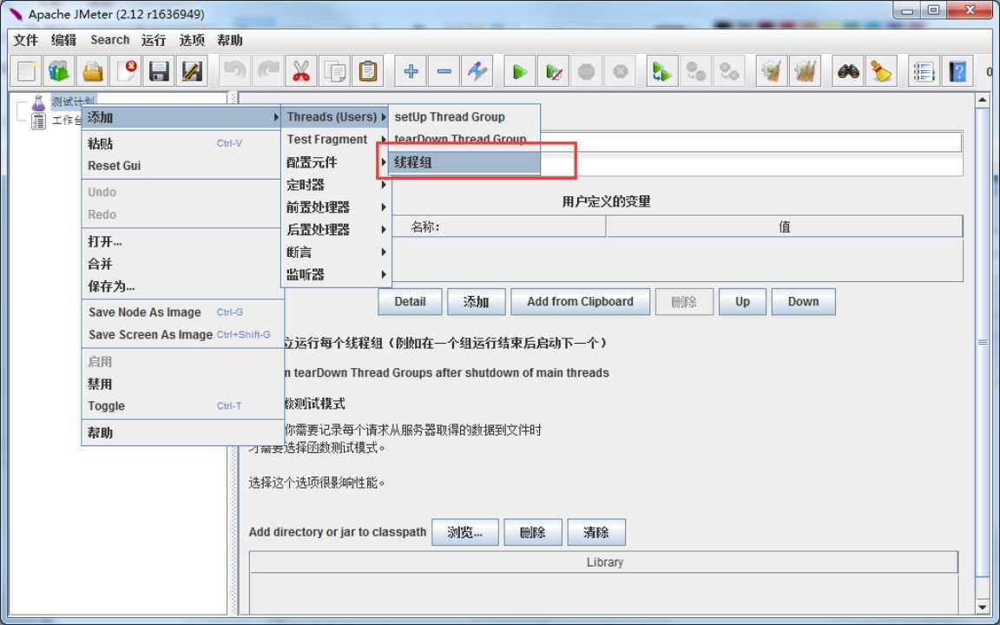

# Jmeter的使用

## 启动jmeter

打开bin目录下的jmeter.bat，启动如下：

 

## 保存方案

## 创建线程组

线程组用来模拟用户的并发访问。

 

 

 

## 创建http请求采样

 

 

## 添加监听报告

 

## 启动

## 查看结果

### 聚合报告

 

### 表格查看结果

 

 

最新样本：他是代表时间的，表示服务器响应最后一个请求的时间。 

偏离   ： 服务器响应时间变化、离散程度测量值的大小，或者，换句话说，就是数据的分布。 