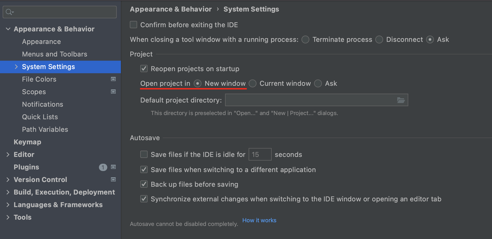
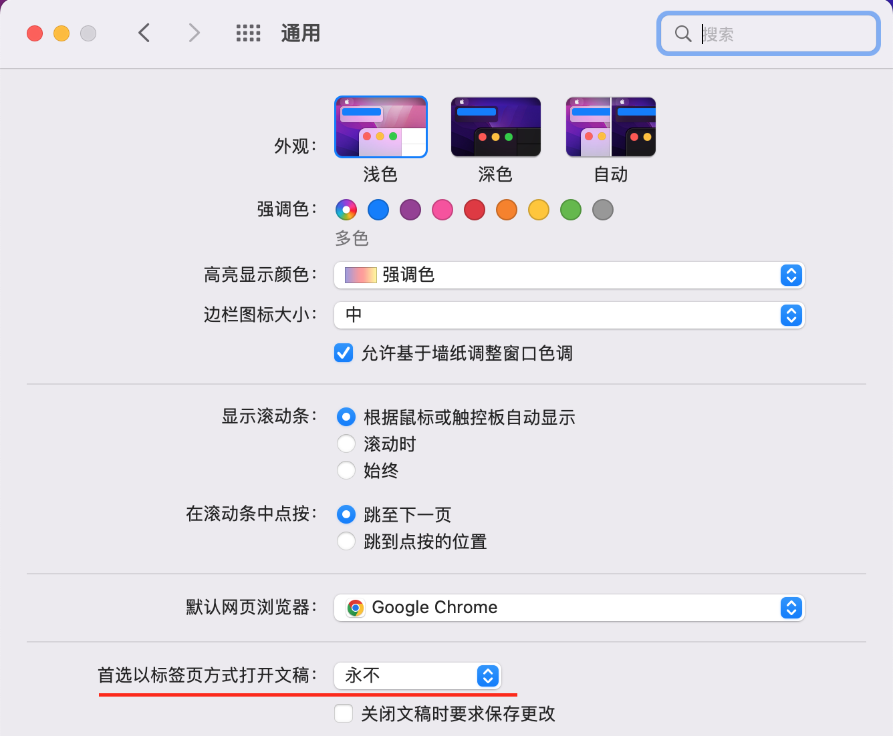
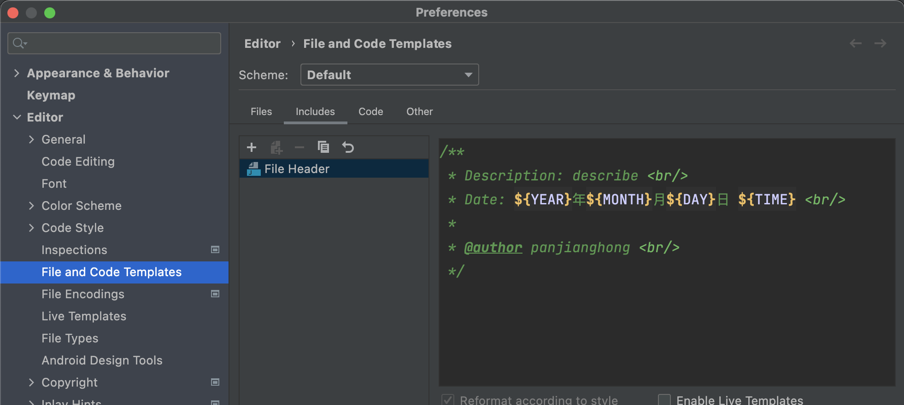
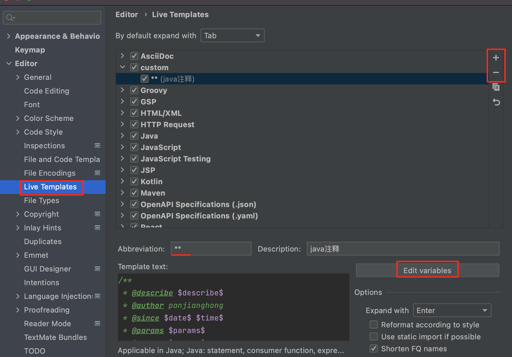
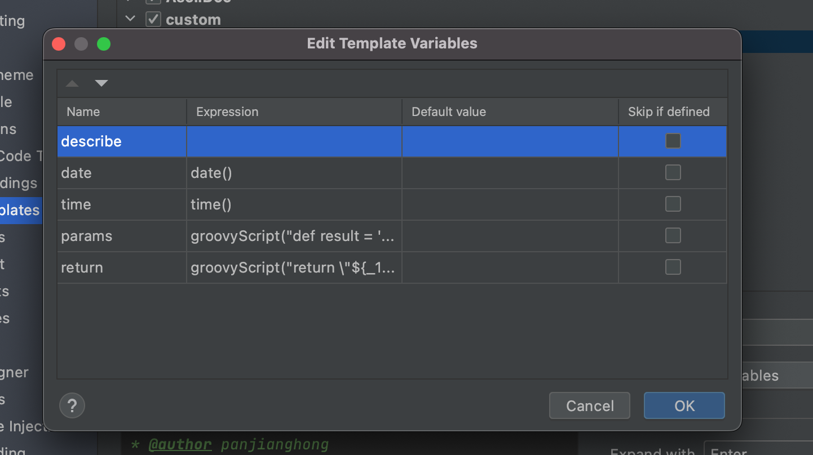
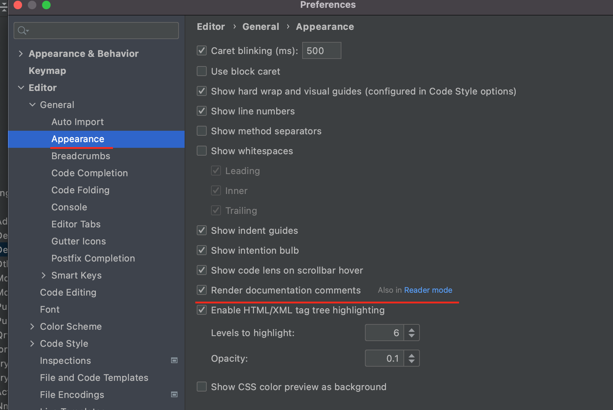
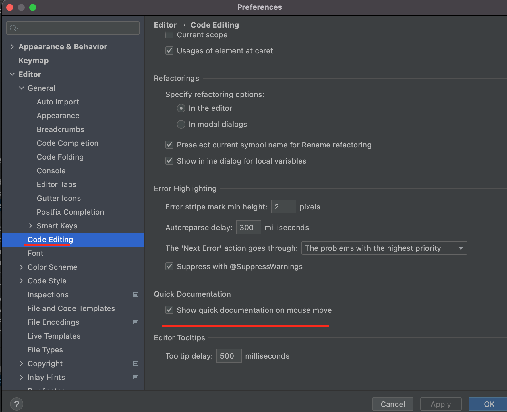
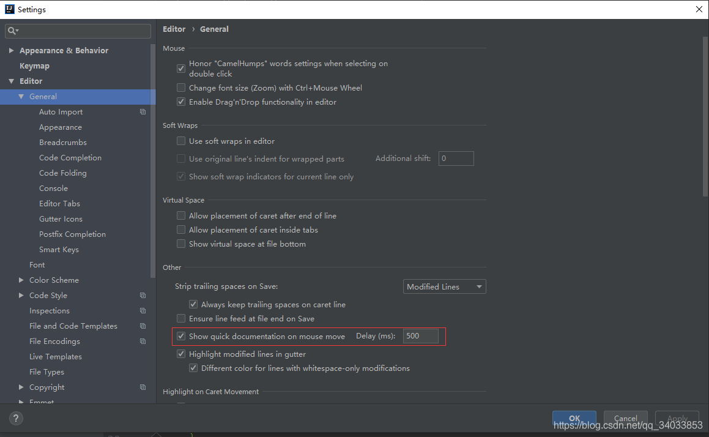
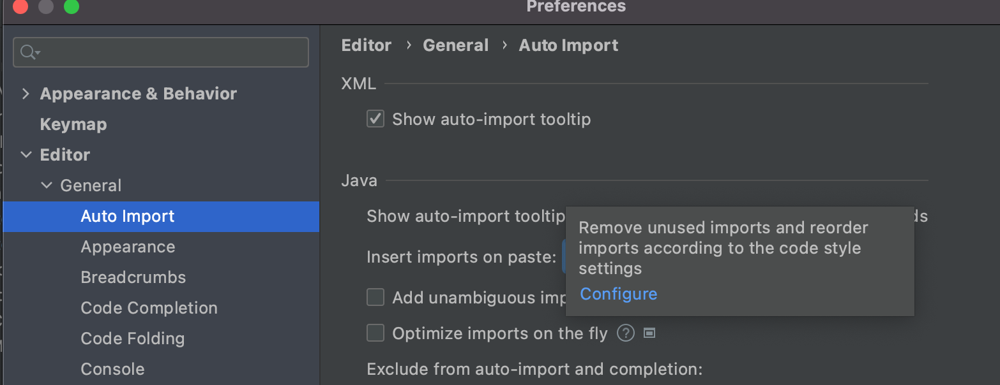

## Mac卸载idea

* 应用程序删除

* 删除其余文件

```shell
rm -rf ~/Library/Preferences/IntelliJIdea
rm -rf ~/Library/Caches/IntelliJIdea
rm -rf ~/Library/Application Support/IntelliJIdea
rm -rf ~/Library/ApplicationSupport/IntelliJIdea
rm -rf ~/Library/Logs/IntelliJIdea
```

* 可以使用 `/usr/libexec/java_home -V` 查看jdk的目录


## 设置项目在新窗口打开

* 设置 -> Appearance & Behavior -> System Settings -> `open project in new window`



* 但是在mac下可能不生效，这是因为和mac自动本身冲突导致的，只需要在 系统偏好设置 -> 通用 -> 首选以标签页方式打开文稿 中选择 `永不` 即可

  


## idea设置注释

### class模板



```
/**
 * ClassName: ${NAME} <br/>
 * Date: ${YEAR}年${MONTH}月${DAY}日 ${TIME} <br/>
 * Description: describe <br/>
 *
 * @author panjianghong <br/>
 */
```


### 注释模板






* 模板 *注意模板不能以 / 开头* 不然param会获取不到 ,` $params$`顶格写

  ```
  **
   * Description $describe$
   * 
   * @author panjianghong
   * @since $date$ $time$
  $params$
  $return$
   */
  ```

* params

  ```
  groovyScript("def result='';def flag=false;def params=\"${_1}\".replaceAll('[\\\\[|\\\\]|\\\\s]', '').split(',').toList(); for(i = 0; i < params.size(); i++) {if (!params[i].equals('')) {flag=true;result+='* @param ' + params[i] + ' ' + params[i] + ((i < params.size() - 1) ? '\\n\\t ':'')} else {result+=' *'}}; return flag ? ' *\\n\t ' + result : result", methodParameters())
  ```

* return

  ```
  groovyScript("return \"${_1}\" == 'void' ? null : \"${_1}\"", methodReturnType())
  ```

  

### 渲染注释



### 鼠标悬浮显示详情

* 2021版本



* 旧版本




## 自动移除导入单位使用的包




## idea闪退(Mac)

!> 进入软件包管理 `/Applications/IntelliJ IDEA.app/Contents/MacOS` 打开 `idea` 文件，会记录闪退原因的信息