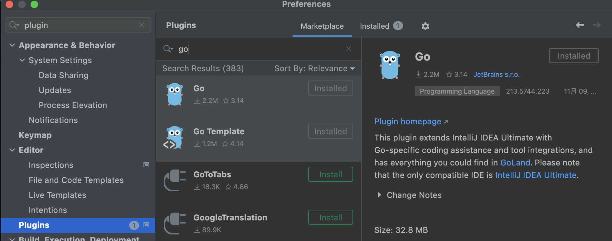

## Mac卸载idea

* 应用程序删除

* 删除其余文件

```shell
rm -rf ~/Library/Preferences/IntelliJIdea
rm -rf ~/Library/Caches/IntelliJIdea
rm -rf ~/Library/Application Support/IntelliJIdea
rm -rf ~/Library/ApplicationSupport/IntelliJIdea
rm -rf ~/Library/Logs/IntelliJIdea
```

* 可以使用 `/usr/libexec/java_home -V` 查看jdk的目录


## 设置项目在新窗口打开

* 设置 -> Appearance & Behavior -> System Settings -> `open project in new window`


* 但是在mac下可能不生效，这是因为和mac自动本身冲突导致的，只需要在 系统偏好设置 -> 通用 -> 首选以标签页方式打开文稿 中选择 `永不` 即可

  


## idea设置注释

### class模板


```
/**
 * ClassName: ${NAME} <br/>
 * Date: ${YEAR}年${MONTH}月${DAY}日 ${TIME} <br/>
 * Description: describe <br/>
 *
 * @author panjianghong <br/>
 */
```


### 注释模板


* 模板 *注意模板不能以 / 开头* 不然param会获取不到 ,` $params$`顶格写，第一个`*`也需要定格写

  ```
  **
   * Description $describe$
  $params$
  $return$        
   * @author panjianghong
   * @since $date$ $time$
   * @version 1.0.0
   */
  ```

* params

  ```
  groovyScript("def result='';def flag=false;def params=\"${_1}\".replaceAll('[\\\\[|\\\\]|\\\\s]', '').split(',').toList(); for(i = 0; i < params.size(); i++) {if (!params[i].equals('')) {flag=true;result+='* @param ' + params[i] + ' ' + params[i] + ((i < params.size() - 1) ? '\\n\\t ':'')} else {result+=' *'}}; return flag ? ' *\\n\t ' + result : result", methodParameters())
  ```

* return

  ```
  groovyScript("return \"${_1}\" == 'void' ? null : ' * @return ' + \"${_1}\"", methodReturnType())
  ```

  

### 渲染注释


### 鼠标悬浮显示详情

* 2021版本


* 旧版本


## 自动移除导入单位使用的包


## idea闪退(Mac)

!> 进入软件包管理 `/Applications/IntelliJ IDEA.app/Contents/MacOS` 打开 `idea` 文件，会记录闪退原因的信息


## idea连接数据库，限制查询行数

执行sql语句的时候，若是没有加分页条件，会默认查询500行数据，影响效率，这里可以设置每次查询的数据行数，提升查询速度。


## go高版本泛型报错`Cannot use 'err' (type error) as the type any`

添加插件 	`go` 和  `go template`




## @Autowired修改提示级别

设置 - Edit – Inspections


